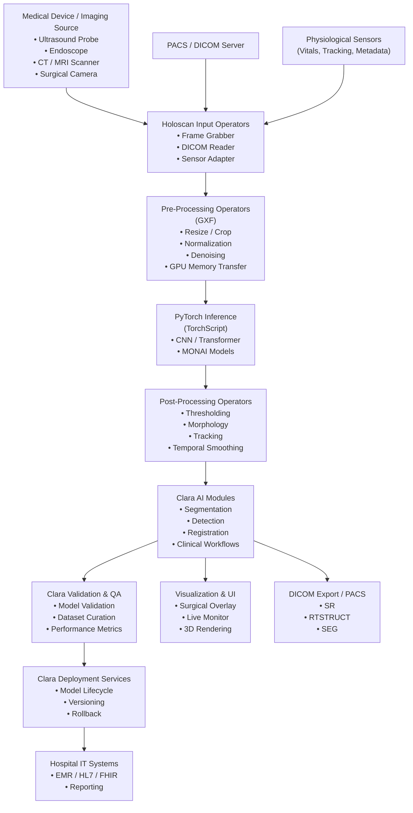

# Overview
Create a clean Python repository for a healthcare AI medical image segmentation POC.

Goal:
Build an end-to-end MONAI-based CT segmentation demo.

Requirements:
1. Use MONAI and PyTorch.
2. Start from the official MONAI spleen 3D segmentation tutorial structure.
3. Refactor notebook-style code into Python modules:
   - src/train.py
   - src/infer.py
   - src/visualize.py
   - src/export_onnx.py
   - src/benchmark.py
4. Add a README that explains:
   - medical imaging task
   - dataset format
   - preprocessing pipeline
   - model architecture
   - inference flow
   - evaluation metric such as Dice score
   - deployment considerations
5. Make the code runnable on a single developer workstation.
6. Add AGENTS.md with setup, test, and verification instructions.

## References:

- Internal link:
https://docs.openvino.ai/2024/notebooks/ct-segmentation-quantize-nncf-with-output.html

- Medical data is from Kits19.
https://github.com/neheller/kits19

